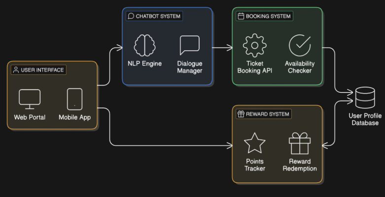

# Sustainable-Tourism

# Brief intro
Sustainable tourism is about fostering a deeper connection between travelers and the authentic essence of India. It invites people to explore the unseen corners of the country, from hidden villages to untouched natural wonders, while respecting the environment and local cultures. By immersing in the unique traditions, art, and handicrafts of each state, travelers not only support the preservation of India's rich heritage but also empower local artisans and communities. This journey blends exploration with responsibility, offering meaningful experiences that celebrate India's diversity while ensuring its treasures thrive for generations to come.
# Workflow diagram

# Concept Map
# Tech Stack
HTML - Structure of website, 
CSS - Website Design, 
Java Script - Interaction, 
WotNot - Chatbot
# Novelity
Ticket Booking through chatbot - Allows users to book tickets and ask queries via chatbot.
Waitlist and Notification System - Users get notified when slots become available. 
Off-the-Beaten-Path Destinations - Encourage tourism to lesser-known, under-visited destinations to reduce overtourism.
# Solution
Encourage eco-tourism and community-based tourism that benefits local populations directly.
Develop sustainable tourism that creates jobs, promotes local culture, and conserves the environment.
Invest in infrastructure for sustainable tourism, such as green transportation and renewable energy.
# Others
In the future, we will try to develop:
Reward Based System - Get discounts, Access free or discounted eco-friendly products and receive free passes to nature reserves, cultural events, or guided tours.
Conservation Funding via Bookings - Part of the travel expense goes to conservation or community projects.
